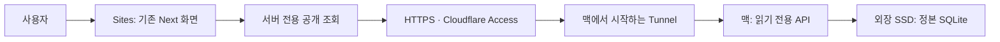

# 프론트엔드·백엔드 연결 및 진행안

2026-10-02. 현재 선택은 맥 외장 SSD의 정본 DB/API와 추후 Sites 화면이다.
이 문서는 실제 준비와 후속 제안을 구분한다. 이번에는 서버 호출 경계를 구현했으며,
터널·도메인·Sites를 생성하거나 Claim을 공개하지 않았다.

## 권장 구조

브라우저는 Sites만 이용하고, Sites 서버가 맥의 공개 조회 API를 호출한다.
연결용 서비스 인증은 화면 번들에 포함하지 않는다. 사용자 로그인과 서버 연결 인증은
서로 다른 경계다. Sites는 나중에 owner-private으로 시작하며 검색 노출은 별도 결정이다.

Cloudflare Tunnel은 맥에서 외부로 연결하므로 직접 인바운드 포트를 열 필요가 없다.
Access의 Service Auth 정책은 허용한 서비스 토큰만 받도록 구성하는 제안이다.
이는 공식 기능을 조합한 설계이며 실제 Sites→Access→Mac 연결은 아직 검증하지 않았다.
[Tunnel 문서](https://developers.cloudflare.com/cloudflare-one/networks/connectors/cloudflare-tunnel/),
[서비스 토큰 문서](https://developers.cloudflare.com/cloudflare-one/access-controls/service-credentials/service-tokens/).
계정·보유 도메인·서비스 비용은 현재 미확인이다. 이를 확인하고 정확한 접근 정책을
검토한 뒤 연결을 생성한다. 무인증 임시 터널은 이 안의 실행 경로에 포함하지 않는다.

## 연결 방식 선택지

| 방식 | 데이터 위치와 화면 | 장점 | 운영 조건 |
|---|---|---|---|
| A. 인증된 실시간 조회 — 권장 | 정본은 SSD, Sites가 맥 API를 조회 | 기존 API·Evidence 계약 재사용, 데이터 변경을 바로 반영 | 맥·SSD·인터넷 가동 필요, 도메인/Access 설정 필요 |
| B. 공개 DTO를 갱신하는 방식 | 정본은 SSD, 승인된 공개 결과만 Sites에 전달 | 맥이 쉬는 동안에도 마지막 공개 결과를 읽을 수 있음 | 별도 파생 조회 캐시·버전/갱신 시각·공개 선택 검증 필요, 실시간성 낮음 |
| C. 로컬 화면 먼저 검증 | 맥 또는 별도 로컬 화면에서 맥 API 조회, Sites는 이후 | 클라우드 연결 전 데이터와 화면부터 확인 | 외부 이용 불가, 실서비스 연결 증거가 되지 않음 |

현재 선택된 토폴로지와 가장 자연스럽게 이어지는 것은 A이며, 먼저 C 수준의 로컬 검증을
거친다. B는 맥의 상시 가동이 어렵다면 검토할 대안이다. B의 결과는 정본/원문 저장소가
아니며 SourceSnapshot이나 비공개 DRAFT를 복제하지 않는다. 아직 구현하거나 선택하지 않았다.

## 각 영역의 책임

| 영역 | 유지할 기준 | 다음 작업 |
|---|---|---|
| 프론트엔드 | 기존 DESIGN·Next 화면·DTO 유지 | 인물 목록→상세→Claim→Evidence→출처 흐름, 데이터 없음/장애/충돌 구분, 모바일·키보드 검증 |
| 서버 조회 | 기존 app/data.ts 하나로 연결 | 고정 API 주소, GET 제한, 서비스 인증, 리다이렉트 금지, 응답 시간 제한 |
| 백엔드 | 기존 FastAPI·Database/UoW·schema 0008 유지 | 출처·신원·공개 게이트 유지, 읽기 전용 API와 SSD 가용성 검증 |
| 수집 | 기존 승인된 deterministic CLI 사용 | 추후 수집 범위·예산을 별도로 승인하고 checkpoint/provenance 감사 |
| 공개 검토 | 기술적 적격성과 실제 공개 결정 구분 | 공개할 Claim의 정확한 목록과 근거를 준비하고 미해결 신원 충돌은 유지 |

현재 SSD는 국회 명부 299개 관측으로 만든 298명·298 DRAFT Claim과 검토 1건이다.
기존 Railway의 9,120명/기관 자료를 모두 SSD로 옮긴 상태는 아니다. 국회 명부 파일럿을
먼저 완성하고, 다른 수집원을 붙이는 것은 그다음 별도 작업으로 정한다.
이 타깃으로 바꾸면 기관/ALIO 자료가 비어 있을 수 있으며 다른 DB로 조용히 우회하지 않는다.

현재 DRAFT는 API의 공개 Claim/Source 출력에서 제외된다. 따라서 이름 목록은 조회되지만
직위·학력·경력·재산 정보가 풍부한 인물 화면이 완성된 것은 아니다. 기존 데이터의
공개 선택과 출처별 보강 작업을 먼저 정하고, 없는 정보는 새로 만들어 채우지 않는다.

## 이번에 준비한 호출 경계

정본 프론트엔드의 app/data.ts에 server-only 경계를 추가했다.
기존 로컬 호출은 그대로 가능하며 HTTPS 서비스 연결을 위한 설정을 준비했다.

| 서버 설정 이름 | 용도 |
|---|---|
| CIVIC_API_URL | 조회 API의 고정 origin. 경로·query·fragment·URL 내 인증정보는 거절 |
| CIVIC_ACCESS_ORIGIN | 서비스 인증정보를 보낼 정확한 HTTPS origin |
| CIVIC_ACCESS_CLIENT_ID | 연결용 서비스 ID, 서버에서만 사용 |
| CIVIC_ACCESS_CLIENT_SECRET | 연결용 비밀값, Sites secret으로만 설정 |

기존 NEXT_PUBLIC_API_URL은 URL의 호환 입력만 유지한다. 서비스 비밀값을
NEXT_PUBLIC 변수에 넣지 않는다. 실제 키/토큰은 이번에 만들거나 읽지 않았다.
환경 설정은 연결 제공자가 확정된 뒤 native Sites 도구로 관리한다.

현재 호출 제한은 다음과 같다.

- 공개 Person/Organization/Source/ontology/국감/money GET 경로만 호출한다.
- ID는 UUID 경로 형태로 제한하고 admin/review/수집/쓰기 호출을 허용하지 않는다.
- 인증정보가 있으면 ID·secret·정확한 HTTPS origin이 모두 일치해야 한다.
- 리다이렉트를 따르지 않으며 8초 이내에 응답하지 않으면 서비스 오류를 반환한다.
- 서비스 인증을 사용하는 조회는 no-store다. 기존 무인증 로컬 목록은 60초 재검증을 유지한다.
- 맥/SSD/연결 장애는 기존 SERVICE_UNAVAILABLE로 전달한다. 이를 빈 목록이나 UNKNOWN으로 바꾸지 않는다.

이 제한은 Sites 내부 호출 경계다. 터널을 연결할 때에도 Mac/edge에서 GET 경로 제한과
Access 기본 거부 정책을 별도로 검증해야 한다. 앱의 호출 제한만으로 원격 API를 보호했다고
판정하지 않는다. API·DB·운영자 콘솔을 브라우저에 직접 연결하지 않는다.

## 구현 순서와 완료 조건

1. **서버 호출 준비:** 이번 작업. 실제 disposable HTTP 리다이렉트·timeout, 토큰 목적지
   불일치·미설정, 잘못된 경로, 기존 오류 의미와 DTO를 검증한다. 전체 코드 게이트를 통과한다.
2. **데이터 읽기 파일럿:** 기존 298 DRAFT의 정확한 공개 선택/근거를 준비한다.
   기술적 적격성을 공개 승인으로 쓰지 않는다. 생년월일 충돌 1건은 해결 근거가 생길 때까지
   제외한다. 공개한 항목만 동일 API에서 Claim→Evidence→Source를 읽는지 확인한다.
3. **화면 검증:** 기존 Person 화면을 실제 데이터 상태로 확인한다. 긴 한국어, 빈 섹션,
   UNKNOWN/PARTIAL, 데이터 서비스 장애를 구분한다. Aside로 데스크톱/모바일/키보드를 검증한다.
4. **Workers 산출물:** 같은 Next 화면을 Vinext/Sites Vite 도구로 빌드한다.
   기존 standalone 개발 경로를 보존한다. 지금의 정적 호환성 12항목 통과는 이 빌드의
   완료 증거가 아니다. 사이트 ID를 임의로 만들거나 다른 화면용 스타터로 대체하지 않는다.
5. **실제 연결:** 도메인·계정·비용·소유권을 확인하고 Tunnel/Access의 구체 설정을 검토한다.
   승인된 서버 인증, 잘못된 토큰 거절, GET 외 요청 거절, admin/review 차단,
   맥/SSD 중단 시 오류 및 복구를 확인한다. 외부 API 주소 생성은 이 단계의 별도 효과다.
6. **Sites 제공:** 이후 배포 단계에서 native 등록/버전 저장/private 배포/status를 사용한다.
   같은 커밋의 화면→API→공개 Claim→Source 읽기가 검증된 뒤 제공한다.

1과 문서 준비 외 단계는 후속 작업이다. 데이터 공개, 새로운 비용/외부 접근과 실제
Sites 배포는 준비된 정확한 대상을 바탕으로 진행한다.

## 협업 배분

Codex MAIN이 백엔드·서버 연결·계약·데이터 게이트·최종 검증을 담당한다.
Opus는 기존 Person 화면의 정보 배치·읽기 흐름 개선을 맡길 수 있다. 전달 범위는
합성/공개 DTO와 DESIGN, Person 페이지·해당 CSS뿐이며 API키·DB·출판 권한은 전달하지 않는다.
수집 담당은 기존 source-specific CLI의 범위·정책·예산을 준비하고 MAIN이 별도로 실행한다.
검토 담당은 읽기 전용으로 회귀/권한/장애 상태를 확인한다.
이 배분은 다음 작업의 안이다. 이번에 Opus를 재호출하거나 새 수집 작업을 가동하지 않았다.

## 확인한 공식 자료

이번 실행 결과: 전체 make verify exit0, Python 862개 통과(선택적 PostgreSQL 4개 제외,
기존 SQLite 경고 6개), 웹 34개 통과(호출 경계 8개 포함), 타입·린트·Golden·아키텍처·
Next 16.3.8 standalone 빌드/자산 검증 통과. npm audit 결과 0건이다.
독립 코드·문서 검토에서도 결함을 찾지 못했다. Vinext 정적 검사도 12항목 통과했으나
Workers 빌드·실연결·화면 검증의 증거는 아니다. 실제 실행 명령과 미실행 항목은
[이번 receipt](../receipts/web-api-bridge-20261002.json)에 기록했다.

- [Next 서버·클라이언트 경계](https://nextjs.org/docs/app/getting-started/server-and-client-components)
- [OpenAI Sites SDK](https://github.com/openai/sites)
- [Vinext](https://github.com/cloudflare/vinext)
- [Cloudflare Tunnel](https://developers.cloudflare.com/cloudflare-one/networks/connectors/cloudflare-tunnel/)
- [Access 서비스 인증](https://developers.cloudflare.com/cloudflare-one/access-controls/service-credentials/service-tokens/)

현재 SDK/MCP 조사와 SSD 런타임의 이전 증거는
[SSD 운영 기록](MAC_SSD_SITE.md) 및 [실행 receipt](../receipts/mac-ssd-site-20261002.json)에 보존한다.
