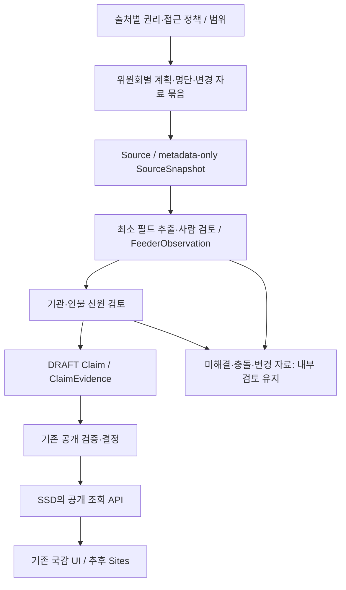

# 국감 피감기관·출석요구 인물 수집 로드맵

2026-10-02, 기준 커밋 `0c7706432521a047b1f12c2e7431e6ac060aa780`.
사용자가 요청한 파이프라인·수집 순서의 정의다. 이 문서 작성은 실제 수집 실행,
SSD 변경, 사람 검토, Claim 공개 또는 배포 실행을 뜻하지 않는다.

## 목표와 현재 출발점

목표 화면은 **위원회 → 피감기관·감사 일정 → 기관증인/일반증인/참고인 → 인물·소속 → 근거**다.
정본 DB/API는 맥 외장 SSD이며, Sites는 검증된 공개 결과를 서버에서 조회한다.

- 과방위 공식 2026-09-22 출석요구 자료 두 건에서 기관증인 직위 370행, 일반증인 29행,
  참고인 13행을 추출했다. 412행 연구 DRAFT이고, 기관증인 이름 셀은 369개다.
  원문별 행/셀 수이며 고유 인물 수는 아니다.
- 기존 7개 위원회 계획 패킷은 보유·검증돼 있다. 현재판의 최신성이나 증인 명단 확보를
  대신하지 않는다. 외교통일위는 원문이 있으나 다일 일정 표현을 v1이 보존하지 못한다.
- 최근 기록된 맥 조회에는 Organizations와 공개 국감 대상이 0건이다. 이번 로드맵 작성에서는
  원격 DB를 재조회하지 않았다. 과거 staging 기관 UUID를 맥에 복사하는 경로는 사용하지 않는다.
- 증인 전용 canonical parser/import/내부 review API와 읽기 전용 계획 연결 검토는 구현됐다.
  현재 명부 연구 파일은 운영 인입용
  `HUMAN_REVIEWED` 패킷이 아니다. 일정 API `ALLSCHEDULE`은 L1 발견 경로이며 실제 사용 가능성은 별도 검증한다.

근거: [출석요구 연결 후보 및 원문 검증](../research/gukgam_2026_science_witness_linkage_2026-10-02.md),
[현재 실행 계획](../exec-plans/active/gukgam-2026-ontology-research.md),
[출처 계약](../architecture/GUKGAM_2026_SOURCE_CONTRACT.md).

## 파이프라인

출처 수집, 관측 인입, 신원 결정, 공개는 별도 효과다. 네트워크/보존 전에 SourcePolicy를
검토하고, 승인된 관측은 기존 UoW/SourceLifecycle에 연결한다. Source/Snapshot/Observation과
checkpoint는 같은 트랜잭션에서 확정한다. SourceSnapshot은 원문 해시를 보존하되 fulltext는
저장하지 않는다. 원문 해시와 정규화 행 해시는 서로 다른 증거다.

위원회 사이트의 반복 자동 수집은 현재 차단돼 있다. 정확한 공식 파일을 확인하는 기존
사람 지원 경로를 사용하며, 허용된 공식 API가 검증된 경우에만 해당 API 범위를 자동화한다.
관측 성공이 Person 연결이나 공개를 승인하지 않는다.

## 위원회 하나에서 수집할 순서

| 순서 | 수집·확인 대상 | 최소 필드 / 목적 |
| --- | --- | --- |
| 1 | 공식 감사계획과 변경 계획 | 명시적 위원회, 피감기관, 날짜/기간, 시간·장소, 원문 판·쪽; 감사 맥락 고정 |
| 2 | 기관증인 명단과 추가·교체 자료 | 기관 제목 묶음, 성명, 직위, 병합 셀·행; 기관별 출석요구 인물 준비 |
| 3 | 일반증인 명단과 추가·철회 자료 | 대상기관, 성명, 소속·직위, 요구 일시, 의결일자, 행 번호 |
| 4 | 참고인 명단과 변경 자료 | 일반증인과 같은 최소 필드, 별도 범주·연번 유지 |
| 5 | 연결에 필요한 공식 기관·직위 자료 | 검토할 기관 코드와 해당 시점의 인물 신원 근거; 선택한 대상에만 한정 |
| 6 | 감사 이후 공식 회의록·출석 관련 자료 | 실제 출석과 발언/결과 확인; 별도 출처·Claim 계약을 검토한 뒤 착수 |

2~4가 하나의 공식 첨부에 있으면 한 번 확보해 범주별로 나눈다. 한 위원회의 계획과 인물 명단을
같은 묶음으로 준비하며, 모든 위원회의 기관을 먼저 끝낸 뒤 인물을 모으는 방식으로 나누지 않는다.
자료를 못 찾았으면 확인하지 못한 범위를 기록한다. 검색 실패만으로 ‘미채택’, ‘증인 없음’ 또는
‘명단 미공개’를 확정하지 않는다. 기사·검색·전재 사이트는 공식 원문 발견용이다.

기관증인 문서의 기관 제목은 명단 묶음이며 개인별 고용 관계를 의미하지 않는다.
일반증인·참고인의 **대상기관**과 **소속·직위**는 별개다. 표에 없는 일시는 추정하지 않는다.
새 계획을 확보할 때 기간·분반·병합 셀을 보존해야 한다. 단일 날짜로 축소되는 행은 내부 검토에 남긴다.

## 구현·검증 로드맵

| 단계 | 작업과 산출물 | 다음 단계로 넘어갈 조건 |
| --- | --- | --- |
| R0 출처 기준 | 과방위 계획·명단의 현재판/명시적 변경 여부, 권리, 정확한 첨부·쪽 범위와 수집 manifest 확인 | 승인된 자료/필드, 확인 기준일, 변경 미확인 범위를 명시; 오래된 자료를 현재판으로 단정하지 않음 |
| R1 계약·오프라인 검증 | 증인 전용 source-specific 계약·parser·내부 review DTO; 기존 계획 계약의 기간/변경 처리 검토 | 세 범주·대상기관/소속 구분·47행 사례·412행 원문 대조·병합 셀·실패/재실행 회귀; L1 기준 충족 |
| R2 검토·관측 인입 | 실제 필드별 사람 검토, 고정 행 manifest, no-write preflight, 승인된 묶음의 SSD 관측 인입 | 원문/정규화 provenance, 행 수, checkpoint 원자성, 변경/재실행 검증; Person/Organization/Claim 생성 0인 acquisition receipt |
| R3 기관·인물 연결 | 공식 코드 기반 기관 검토, 출처 행별 인물 신원 결정; 미해결은 내부 후보 유지 | 각 승인 연결의 근거/시점/대상 DB 확인; 동명이인·교차 출처 충돌 회귀와 별도 materialization receipt |
| R4 근거·공개 검토 | 출석요구 명단 기재와 기관 감사대상 기재의 DRAFT Claim/Evidence 준비 | 정확한 source/행/identity를 재검증하고 기존 publication gate 통과; 실제 출석을 주장하지 않음 |
| R5 화면·전달 | 공개 API DTO와 기존 국감 화면 연결, 인물 상세·Evidence 경로, 이후 인증된 Mac→Sites 조회 | 같은 커밋/DB의 API와 Aside 데스크톱·모바일·키보드 검증; 비용·접근 범위가 확정된 배포만 별도 실행 |
| R6 위원회 확대 | 아래 순서로 각 위원회의 계획·기관증인·일반증인·참고인·변경 묶음 처리 | 위원회별 source/관측/신원/공개 coverage를 분리해 보고; 한 위원회의 차단이 다른 승인 묶음의 진행을 막지 않음 |
| R7 감사 이후 | 공식 출석·회의록·결과의 새로운 출처 계약 | 실제 출석/발언/결과를 각 근거로 검증; 명단의 요구 일시만으로 참석/문제/위법을 추정하지 않음 |

현재는 [R1 증인 계약·검토 경로](../architecture/GUKGAM_WITNESS_PACKET.md)의 구현·오프라인 검증을
완료했다. 전체 `make verify`가 통과했으며, R2의 고정 패키지 전달·맥 원문/패킷 점검·읽기 전용
경계 검사·SSD 백업/복원 읽기 검증도 완료했다.
실제 연구 자료는 사람 검토 전 DRAFT이며, 운영 SSD 관측 인입·신원·공개는 아직 없다.
필드별 검토를 기다리는 동안 독립적인 구현·회귀와 실행 패키지 준비를 계속한다.
R3의 독립 준비로 기존 `inspect gukgam-witness`에 계획 패킷 비교를 추가했다. 과방위 412행에서
같은 위원회/연도의 기관명 후보 1개는 288행, 여러 후보는 108행, 일치 후보 없음은 16행이다.
47행 파일럿은 모두 일정 후보 2개를 유지한다. 기관·인물 신원이나 정확한 일정 선택의 승인이
아니며, 계획의 원문 바이트/현재판 확인과 실제 원문 필드 검토는 별도다.
[계획 연결 구현·검토 증거](../receipts/gukgam-witness-plan-review-20261003.json).
R2의 행 manifest가 일부이면 그 일부만 인입·완료로 보고한다. L2는 승인된 사람 지원 묶음의 검증·인입
증거로 판정한다. 전국/L3 완료는 전 위원회 universe와 접근 계약, coverage·resume 등 모든 조건을
충족해야 하며 47행 또는 412행 파일럿으로 대신하지 않는다. 정기 동기화/L4는 이 로드맵에서 실행하지 않는다.

R6의 수집 확대는 R1 계약과 R2 파일럿 인입이 검증되면 R3~R5와 병행할 수 있다.
Sites 배포를 기다리며 승인된 다음 위원회 자료 수집을 멈출 필요는 없다. 각 묶음의 신원·공개
게이트는 개별적으로 통과하고, 수집 속도에 맞춰 미검토 항목을 공개하지 않는다.

### 첫 연결 검증 범위

과기정통부 본부의 기관증인 32행 + 과기정통부 감사 일반증인 13행 + 참고인 2행 = **47행**을
첫 연결·화면 사례로 사용한다. 일반증인·참고인 15행의 원문 요구 일시는 2026-10-06 14:00이다.
기관증인 32행에는 일시 열이 없으므로 같은 날짜를 복사하지 않는다. 47행은 고유 인물 수가 아니다.

두 공식 첨부의 전체 연구 범위는 계속 412행으로 유지한다. 이 중 승인된 첫 47행을 먼저 검증하고
과방위 전체로 확대할 수 있으나, 일부 행의 승인·표시를 전체 원문 검토 완료로 보고하지 않는다.
첫 공개는 확인된 기관/인물/Claim만 포함하고, 나머지는 내부 미해결 상태와 coverage에 남긴다.

## 위원회 확대 순서

순서는 **현재 자료 준비도 → 공식 감사 일시의 임박성 → 변경/철회 대응 → 같은 조건이면 아래 순서**로
정한다. 날짜 우선 판단에는 새로 확인한 공식 계획만 사용한다. 아래 묶음은 기존 자료 재사용을 위한
기본 순서이며 정치적 중요도 또는 최신 명단 공개 여부에 대한 판정이 아니다.

| 차수 | 대상 | 진행 기준 |
| --- | --- | --- |
| 1 | 과방위: 과기정통부 47행 → 과방위 전체 412행 | 실제 확보한 출석 명단으로 계약·인입·신원·공개 경로를 증명 |
| 2 | 국회운영 → 국방 → 행정안전 → 문화체육관광 → 농림축산식품해양수산 → 재정경제기획 | 보유 계획 패킷을 재사용하되 현재판 및 증인/참고인 명단은 각각 새로 확인 |
| 3 | 외교통일 | 기간 일정이 손실 없이 처리되는 계약/회귀를 먼저 통과; 원문 보유만으로 인입하지 않음 |
| 4 | 법제사법 → 정무 → 교육 → 산업통상자원중소벤처기업 → 보건복지 → 기후에너지환경노동 → 국토교통 → 정보 → 성평등가족 | 기존 인벤토리의 남은 위원회; 정확한 위원회명/원문/권리부터 갱신, 공개된 범위만 처리 |

기존 17개 위원회 목록과 adoption 상태는 2026-09-19 인벤토리 기록이다. 특히 당시 보건복지위
`NOT_YET_ADOPTED`를 현재 상태로 재사용하지 않는다. 실제 감사 일시가 먼저인 승인 묶음이나
이미 표시 중인 명단의 공식 철회/교체는 위 기본 순서보다 우선한다. 미발견/접근 불가 자료는
그 범위를 보류하고 다음 확인 가능한 위원회로 진행한다. 예결특위는 현재 17개 상임위 범위 밖이다.

## 신원 보강과 변경 처리

- 기관은 기존 org.go/MOIS의 공식 namespace·기관 코드를 검토 근거로 사용한다. 보유 관측과
  현재 시점 차이는 확인하고, staging UUID 또는 기관명 일치만으로 맥 Organization을 만들지 않는다.
- 인물은 선택된 출석요구 행에 필요한 공식 직위/기관 자료부터 확인한다. 기관 유형에 따라
  ALIO/CleanEye, 공시대상 기업이면 허용된 OpenDART 등 기존 source-specific lane을 검토한다.
  명부의 행 키·쪽·연번은 Person ID가 아니다. 동명 국회의원과 회사 대표도 자동 병합하지 않는다.
- 원문 묶음 관계와 원문 대상기관 관계는 연구·내부 검토에서 직접 보존한다. 이를 미해결 Person
  신원과 혼동해 원문 필드를 UNKNOWN으로 지우지 않는다. 반대로 원문 관계를 canonical identity
  또는 검증된 고용 관계로 승격하지 않는다.
- 원문 SHA가 바뀌면 별도 SourceSnapshot과 판 정보를 보존한다. 같은 정규화/관측의 재실행은
  무효과로 검증하고, 변경된 행은 불변 버전으로 남긴다. 행 이동/연번 변경과 사람 변경을 구분하며
  같은 메타데이터의 새 원문 판도 현재 표시 provenance에서 손실되지 않는지 회귀로 확인한다.
- 공식 자료가 명시한 추가/철회/대체와 범위를 확인한 뒤 현재 표시를 재검토한다. 후속 PDF에서
  이름을 못 찾았다는 이유만으로 자동 철회·삭제하지 않는다. 판 사이 충돌은 현재 결과로 조용히 섞지 않는다.
- 요구 일시, 의결일자, 게시일, 캡처 시각, 실제 출석일을 구분한다. 연락처·주소·생년월일·성별·연령,
  신문요지 전문과 원문 전체는 이번 최소 필드 계약에 추가하지 않는다.

## 실행 주체와 완료 지표

| 주체 | 책임 |
| --- | --- |
| MAIN/Codex | canonical 계약·게이트·CLI 통합, 정확한 target/manifest, 유일한 운영 writer 배정, 최종 검증 |
| 별도 수집 에이전트 | 출처별 범위·parser·offline fixtures·검토 파일·유한 실행 요청 준비; 운영 키/DB 공개 권한 없음 |
| 맥의 고정 runner | 검증된 불변 코드/패키지로 승인된 인입만 실행; SSD writer는 한 개, API는 읽기 전용 유지 |
| 실제 검토자 | 필드별 원문 확인·기관/인물 신원·공개 항목 결정; 에이전트가 검토자의 서명을 대신하지 않음 |
| Opus 프론트 협업 | R1의 DTO/상태/근거 동선이 정해진 뒤 기존 DESIGN·화면 개선; Codex가 통합·Aside 검증 |

역할 배분은 실제 도구/키 격리의 증거가 아니다. R2 전에 고정 runner의 파일·네트워크·대상 DB
권한과 제한을 검증한다. 서브에이전트에는 운영 비밀값을 전달하지 않는다.

API lane의 요청 수·간격·timeout·run budget은 출처별 정책과 정확한 실행 요청에서 정한다.
이전 국회 명부의 8회/120초/180초를 국감 문서·다른 API에 그대로 적용하지 않는다.
사람 지원 문서는 공식 기록/첨부의 유한 manifest가 범위다. R1의 `civic inspect/observe gukgam-witness`는
기존 kernel/UoW와 효과 분리를 재사용한다. 로컬 코드 구현과 맥 고정 runner 검증·설치는 별도 증거로
보고하며, 운영 인입은 실제 필드 검토와 정확한 artifact/preflight를 통과한 묶음만 받는다.

운영 쓰기 전에는 정확한 SSD DB/schema/가동 상태, 일관된 백업과 sole-writer 배정을 재확인한다.
소스 agent와 MAIN의 작업트리에서 곧바로 운영 collector를 실행하지 않는다. 새 코드의 고정 runner
설치/검증, source-specific 실행 요청, 신원 materialization, Claim publication은 서로 구분한다.

진행 보고는 문서 가족별 확보/권리 검토, 원문 대비 추출·사람 검토 행 수, 승인 신원 연결 수,
공개 Claim 수, 공개 화면 수, 변경 미해결 건수를 따로 표시한다. 여러 직위·반복 등장·요구 행을
고유 사람 수로 합산하지 않고 API 오류를 0건으로 표시하지 않는다.
코드 milestone은 targeted regression과 `make verify`, persistence 변경은 Alembic round trip,
UI milestone은 실제 Aside 검증을 요구한다. 수집 성공·코드 통과·사이트 배포 완료는 별도 판정한다.

현재 다음 단위는 **R2 인입: 실제 원문 필드 검토 후 정확한 47행 manifest의 관측 인입**이다.
그 전 준비는 [맥 실행 증거](../receipts/gukgam-witness-mac-preflight-20261003.json)에 기록했다.
