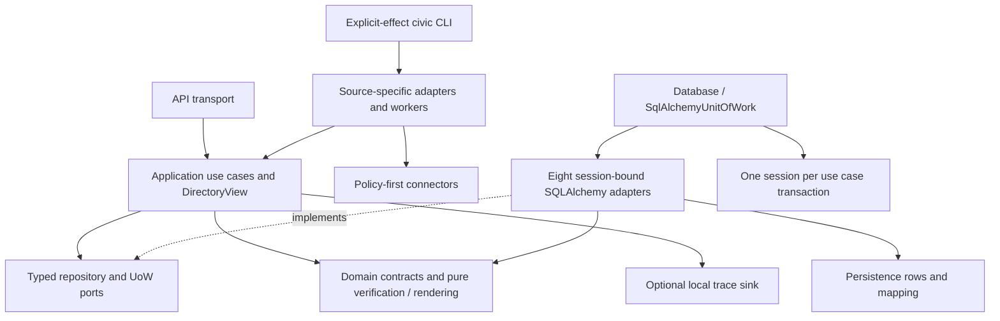

# Latest-master architecture refactor receipt

Status: COMPLETE — local architecture work order accepted. Updated 2026-10-01.

## Pins and scope

Base: `77e2767ab043738f00b8dd38be8d99803e5ad7bc`; remote master was rechecked and still matches.
Verified source: `0ae694578125a9a070053205cf790880d9e07148`, branch `codex/architecture-current-master`, isolated architecture-current-master worktree.
Final evidence-only commits do not change the verified source. Original master remains untouched,
including the existing modified domain contracts. No push, PR, merge, deployment or operational run occurred.
Installed wheel SHA-256: `2c6cbf5e06ef16dafb3822eae431f918757ec67af28d343a2f441c560a37bcc4`.
Canonical full-gate log SHA-256: `3b07adb15460e663b8d05717bf5d055be780e66d1872599b71f0e6f5db3328d4`;
local log: `.tools/check-_tools_make_ucrt64_bin_mingw32-make_exe-75e8a17950.log`.

## Dependency result

Dependencies point inward through ports; domain/application import no SQLAlchemy, FastAPI,
worker or connector implementation. Runtime composition selects the canonical Database/UoW.
Person/Organization eligibility, temporal records, source reachability, UNKNOWN, signed admin
preview/replay/receipt rules and ClaimEvidence publication gates remain covered by regressions.

## Before / after

| Area | Before | After | Why |
|---|---|---|---|
| Domain | SQLAlchemy rows in domain/db.py | Pure contracts; rows in persistence/models.py | Keep semantics independent of infrastructure; row AST unchanged |
| Orchestration | API/repository/worker coordination | Explicit application services, ports and DirectoryView | Put transaction and publication decisions in use cases |
| Persistence | 3,818-line repository opening many sessions | Eight capability adapters sharing one UoW/session | Preserve atomic operations without another God interface |
| Acquisition | Repeated run/checkpoint/page lifecycle | SourceLifecycle shared by nine enumerators in eight modules | Reuse proven lifecycle; retain source-specific coverage and cursors |
| CLI | 19 scripts; sync/stage flags concealed stronger effects | civic with 37 explicit observe/materialize/publish/review/inspect routes | Reject wrong effect before worker/DB dispatch |
| Public reads | Several independently opened sessions per response | One read UoW; PostgreSQL REPEATABLE READ, SQLite read transaction | Coherent snapshot; read adapters reject ORM and raw/Core writes |
| Startup | Environment could enable Golden seeding | Readiness check only; explicit fixture onboarding | A runtime environment cannot mutate canonical data on startup |
| Context | Large handoff/plan; broad root instructions | Bounded handoff/plan, 57-line AGENTS, progressive skill and preserved archives | Resume from current evidence without losing historical gates |
| Operations | Limited shared trace correlation | Trace/run/parent IDs, SourceRun correlation, stable failure class and local sink | Diagnose acquisition without SaaS or political-evidence dependency |

## Findings closure

The attached prior audit supplied no severity ratings. "Not specified" preserves that fact;
P1/P2 below are severities assigned by the independent reviews in this run.

| Finding | Original severity | Status | Evidence |
|---|---|---|---|
| Domain ORM dependency | Not specified | CLOSED | Model AST equivalence; executable architecture contract |
| Repository size / application orchestration | Not specified | CLOSED | ports.py, eight adapters, named services; UoW and existing regressions |
| Repeated enumerator lifecycle | Not specified | CLOSED | ingestion.py SourceLifecycle; source-specific multi-page/resume tests |
| Mixed sync/stage effects | Not specified | CLOSED | Retired sync/worker-main paths; 37-route registry and rejection tests |
| Incoherent public reads | Not specified | CLOSED | API per-request UoW; SQLite and actual concurrent PostgreSQL regressions |
| Large continuation and broad instructions | Not specified | CLOSED | Lean AGENTS/HANDOFF/plan; original handoff and Gukgam history retained verbatim |
| Unspecified cost/model routing | Not specified | CLOSED | MODEL_ROUTING.md uses actual runtime selection; bounded Luna inventories/reviews |
| Missing correlated operational trace | Not specified | CLOSED | tracing.py; correlation and sink-failure regressions |
| API Golden environment seeding | P1 | CLOSED | Startup readiness only; explicit fixture seed; independent reviewer closure |
| PostgreSQL snapshot/write rejection gap | P1 | CLOSED | Four actual PG tests, including concurrent snapshot and read-only write guard; reviewer closure |
| Policy/provenance checked after identity matching | P2 | CLOSED | Policy gate before every identity branch; eight revoked/spoofed-source regressions; reviewer closure |
| Schedule probe mislabeled read-only | MAIN, no rating | CLOSED | SOURCE_INGESTION CLI; policy/effect rejection before network/dispatch |
| Remote CI for this branch and branch governance | Not specified | DEFERRED_WITH_REASON | Branch not pushed; protection read returned 404 and no rulesets; security/remote changes outside grant |

Independent quality and risk reviewers did not edit submitted production files. They checked the
6a231fa closures and reported no remaining concrete issue in their reviewed scope; they did not
execute the acceptance suite. MAIN verified the final fixture/probe delta, reviewed the diff,
and owns executed acceptance evidence. No external source/context review was invoked.

## Important paths

- Added: packages/application/{ports,context,queries,ingestion,tracing,identity,publication}.py and named services.
- Added: packages/persistence/{database,mapping,acquisition,administration,identity,onboarding,organizations,profiles,public,review}.py.
- Moved: packages/domain/db.py → packages/persistence/models.py; row semantics unchanged, schema remains 0008.
- Added: apps/cli/{main,adapters}.py and packages/verification/{architecture,assembly_provenance,assembly_roster_failure_smoke,assembly_roster_observation_audit,postgresql_ci_counts}.py.
- Removed: packages/persistence/repository.py, workers/sync.py, legacy console scripts and obsolete mixed worker parsers.
- Context: AGENTS.md, docs/workflows/REPOSITORY_RULES.md, docs/roles/MODEL_ROUTING.md, skill reference, HANDOFF, completed plan and history archives.
- Operating proposal: docs/operations/COLLECTION_AGENT.md. UI implementation and dependency lockfiles were not changed.

## Local verification

Runtime: Python 3.12.10, PostgreSQL 18.6, Node 25.2.1, npm 11.6.2; disposable fixtures only.
The ignored .tools runners scrub operational environment names without printing values or reading .env.
No operational credential or connection value is included in this receipt.

| Actual command | Observed result |
|---|---|
| python .tools/run_clean.py .tools/make/ucrt64/bin/mingw32-make.exe verify | PASS, child and runner exit 0; all canonical gates completed |
| python -m ruff check apps packages workers tests | PASS |
| python -m mypy packages workers apps/api apps/cli | PASS, 146 source files |
| python -m pytest (inside make verify) | PASS, 728 tests; 4 PG tests skipped here and separately executed below; 6 warnings |
| python -m packages.verification.quality | PASS, Golden evidence/publication quality contract |
| python -m packages.verification.architecture | PASS, dependency/retired-path/context contract |
| npm --prefix apps/web run lint; npm --prefix apps/web run typecheck | PASS, exit 0 |
| npm --prefix apps/web test | PASS, 26 tests, zero failures/skips |
| npm --prefix apps/web run build | PASS, Next build and standalone runtime assets prepared; no visual acceptance claim |
| python .tools/run_clean.py python -m pytest tests/test_gukgam_schedule_probe.py tests/test_cli_effects.py tests/test_deployment_contract.py | PASS, 68 tests, exit 0 |
| python .tools/postgres_fixture_verified.py | PASS, exit 0; actual PG 4 tests, migration and dump/restore |
| python -m pytest tests/test_postgresql_integration.py -q (fixture-only POSTGRES_TEST_URL) | PASS, 4 tests, no skips; 6a231fa persistence/application code unchanged afterward |
| pg_dump / createdb / pg_restore --exit-on-error (fixture-only loopback target) | PASS, exit 0; restore revision 0008, 16 People, 10 public People, 7 published Organization Claims |
| python .tools/installed_fixture_final2.py | PASS, exit 0; final wheel installed and invoked outside source checkout |
| python -m pip wheel --no-deps --no-build-isolation --wheel-dir .tools/wheels . | PASS, final wheel hash pinned above |
| python -m alembic upgrade head; python -m alembic downgrade -1; python -m alembic upgrade head (fresh fixture DATABASE_URL) | PASS, all exit 0, 0008 → 0007 → 0008 |
| installed civic observe assembly --allow-effect SOURCE_INGESTION (fixture-only target, API key removed) | Expected exit 1; safe failure receipt, exactly one FAILED SourceRun, zero observations/checkpoints; no network |
| installed python -m packages.verification.assembly_roster_failure_smoke --receipt <fixture-log> --exit-code 1 | PASS, safe missing-key contract |
| installed civic inspect commands | PASS, 37 routes, no worker/DB invocation |
| npm run check --prefix .railway | PASS, TypeScript check only; no provider execution |
| git diff --check; model AST / archived-content comparisons | PASS; original model and both full histories retained |

Earlier full runs exposed stale workflow/deployment expectations and a fabricated Assembly fixture
rejected by the stronger provenance gate. Those were corrected before the final gate. The earlier
Windows output-forwarding runner failed on cp949 Unicode after child completion; the UTF-8 runner
was fixed. Such failed earlier invocations are not reported as final acceptance PASS.
Baseline collection found 649 cases, but its exit code was not captured; it is characterization,
not an explicit baseline PASS. Six SQLite datetime deprecation warnings are retained as warnings.
Allocated PostgreSQL clusters were stopped and temporary fixture password files removed.

## CI, live runtime and deployment

| Evidence class | State | Limit |
|---|---|---|
| Current-branch remote CI | NOT_RUN | No push/PR; updated workflow contracts passed only locally |
| Earlier master Verify | Historical only | Does not establish acceptance of this branch |
| Live source or operational DB | NOT_RUN | No acquisition, materialization, publication or admin mutation |
| Browser / visual acceptance | NOT_RUN | No UI change or Aside stage; build success is not visual acceptance |
| Docker image build | NOT_RUN | Docker command unavailable locally |
| Deployment / public exposure / governance apply | NOT_RUN | No provider apply, domain/indexing/security change or paid resource creation |

## Concrete remaining debt and operator boundary

The refactor adds no database-enforced collector lease or OS credential/tool isolation. A dedicated
one-shot runner must prove sole-writer allocation, target restrictions and enforced rate/run budget
before live access. Several recurring writers require a separate tested lease/recovery change.
The inherited reviewed distinct-Person path publishes a role Claim; it is accurately classified
CLAIM_PUBLICATION until an identity-only operation is separately requested. Existing Gukgam source,
41-pair human-review and public-release gates remain in their bounded research plan.

## Final next action

Select and approve one exact collector run request: source, dedicated target and bounded scope,
using docs/operations/COLLECTION_AGENT.md. The architecture refactor is complete; this is a separate
operator-only decision and does not block local acceptance.
